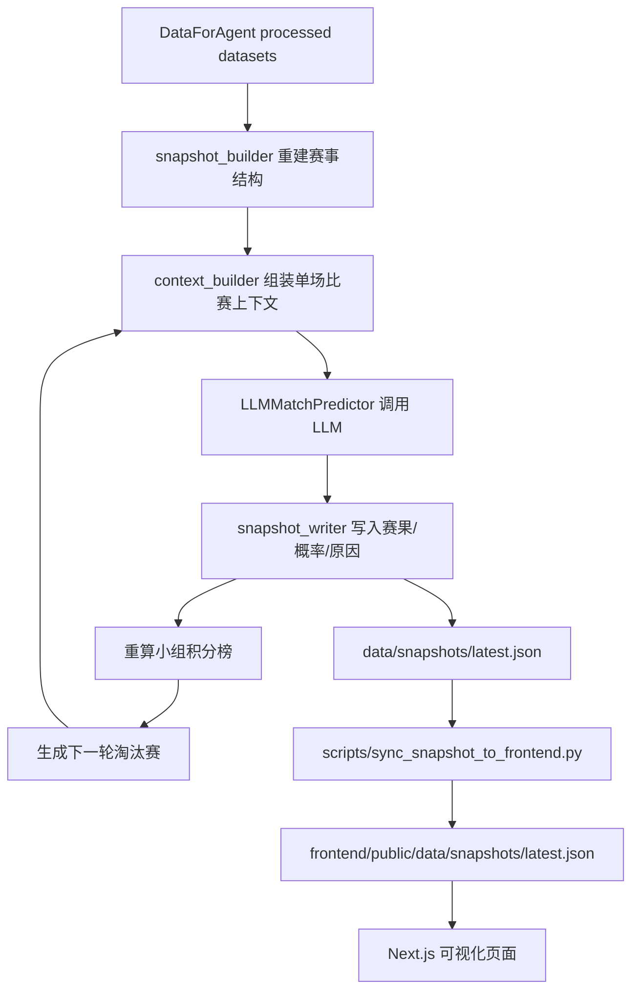

# WorldCupAgent

世界杯冠军预测 Agent。项目以 `DataForAgent` 的赛前球队、教练、球员、历史比赛等数据为基础，通过 LLM 逐场预测小组赛和淘汰赛结果，最终输出冠军预测，并在 Next.js 前端中展示完整赛程树、比分、胜负概率和每场比赛的推理原因。

当前项目说明以以下文档为准：

- [当前项目指南](./docs/CURRENT_PROJECT_GUIDE.md)
- [Agent 架构与工具链](./docs/AGENT_ARCHITECTURE_AND_TOOLCHAIN.md)

## 当前能力

- 从 `DataForAgent/data/processed/worldcup/wc_2026_squad_normalized.json` 重建 48 队、12 个小组、小组赛和 32 强淘汰赛结构。
- LLM 根据每场比赛的上下文逐场输出固定 JSON，包含胜负、比分、概率、置信度、中文原因和结构化原因因子。
- 后端按真实赛事推进方式重算小组积分榜，并逐轮生成下一轮淘汰赛对阵。
- 前端展示首页冠军预测、Top 5 争冠队、分组积分、完整淘汰赛树。
- 点击任意小组赛或淘汰赛节点，可查看 LLM 对该场比赛的推理依据。
- 保留 multi-agent 辅助层，用于数据加载、强度摘要、反思检查、解释文本和质量检查。

## 架构总览



核心实现位于：

```text
worldcup_agent/llm_agent/
  llm_client.py        LLM API 客户端，兼容 OpenAI chat completions 协议
  predictor.py         单场比赛 LLM 预测器和输出校验
  context_builder.py   DataForAgent 到 LLM prompt payload 的上下文构造
  snapshot_builder.py  从赛前名单重建小组赛和淘汰赛结构
  snapshot_writer.py   逐场预测、逐轮推进、写入 latest.json

worldcup_agent/multi_agent/
  agents.py            Data/Analysis/Simulation/Reflection/Explainer/Quality 辅助 agents
  main.py              multi-agent 辅助管线入口

frontend/
  src/app/             Next.js 页面路由
  src/components/      Dashboard、赛程树、比赛详情弹窗
  src/lib/             snapshot 读取、转换和前端类型
```

## 运行方式

先根据 [.env.example](./.env.example) 创建项目根目录下的 `.env.local`，其中配置 LLM 服务。不要提交真实密钥。

```text
LLM_PROVIDER=xfyun-maas
LLM_API_KEY=your_api_key
LLM_BASE_URL=https://maas-api.cn-huabei-1.xf-yun.com/v2
LLM_MODEL=xop35qwen2b
LLM_MAX_RETRIES=5
LLM_RETRY_BASE_SECONDS=3
LLM_REQUEST_DELAY_SECONDS=1.2
LLM_TIMEOUT_SECONDS=120
```

完整生成并同步前端数据：

```powershell
python scripts\generate_and_sync.py --require-llm
```

先小批量测试 LLM 连通性：

```powershell
python scripts\generate_and_sync.py --require-llm --llm-match-limit 10 --skip-agent
```

只用本地 fallback 快速重建数据，不调用 LLM：

```powershell
$env:LLM_DISABLE="1"
python scripts\generate_and_sync.py --skip-agent
Remove-Item Env:\LLM_DISABLE
```

启动前端：

```powershell
cd frontend
npm run dev -- -p 3000
```

访问：

```text
http://localhost:3000
http://localhost:3000/schedule
http://localhost:3000/teams
http://localhost:3000/data
http://localhost:3000/agent
```

## 校验命令

```powershell
python -m compileall worldcup_agent\llm_agent scripts\generate_and_sync.py
python -m json.tool data\snapshots\latest.json

cd frontend
npm run lint
npm run build
```

## 关键数据文件

```text
DataForAgent/data/processed/index.json
DataForAgent/data/processed/worldcup/wc_2026_squad_normalized.json
data/snapshots/latest.json
frontend/public/data/snapshots/latest.json
data/multi_agent/multi_agent_output_*.json
```

## 当前复盘结论

项目主线已经符合目标：它能采集并读取世界杯相关数据，使用 LLM 逐场分析胜负和比分，生成从小组赛到决赛的完整推演，并用前端页面展示冠军预测、赛程树和单场推理原因。

仍建议继续完善：

- 为 LLM 输出增加更严格的 JSON Schema 校验和自动重试修复。
- 为 `snapshot_builder`、中文球队 id、淘汰赛晋级逻辑补充自动化测试。
- 增加断点续跑能力，减少 104 场完整 LLM 调用中断后的重复成本。
- 将旧 `prediction/` 和旧文档进一步归档，减少与当前 LLM-first 架构的混淆。
- 扩展数据来源，接入更稳定的 FIFA 排名、ELO、伤病、赛程场地和旅途距离数据。
