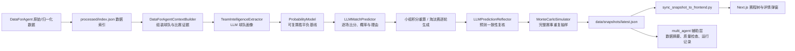

# WorldCupAgent

面向 2026 世界杯的冠军预测 Agent。项目从 `DataForAgent` 的赛前资料出发，生成小组赛到决赛的逐场胜平负、比分、概率与可解释原因；前端以赛程树、球队画像和比赛详情弹窗展示结果。

> 当前定位：这是一个可运行、可解释的赛前预测原型，不是官方赛程或实时赛事系统。预测结果只用于分析展示，不构成投注或决策建议。

## 目标验收

| 目标 | 当前状态 | 实现位置 |
| --- | --- | --- |
| 获取历史战绩、名单、分组、球员与球队资料 | 已具备 | `DataForAgent/`、`worldcup_agent/data_layer/` |
| 分析并逐轮推演赛事 | 已具备 | `worldcup_agent/llm_agent/` |
| 输出冠军、比分、概率和推理依据 | 已具备 | `data/snapshots/latest.json` |
| 展示赛程树和比赛详情 | 已具备 | `frontend/` |

当前快照可验证为 12 个小组、72 场小组赛、32 场淘汰赛、48 支球队画像和 10,000 次完整赛事抽样。比赛详情包含 LLM 推理因素、概率模型基线和反思结果。

## 端到端架构



`multi_agent` 是快照的辅助审阅与说明层：它读取既有预测和蒙特卡洛结果，不替代 LLM-first 主预测链路。

## Agent 与工具链

| 环节 | 工具/模块 | 输出 |
| --- | --- | --- |
| 数据采集与归一化 | `DataForAgent/src/collectors`、`normalizer` | 五大联赛、历史世界杯、2026 名单与分组数据 |
| 数据访问 | `worldcup_agent.data_layer` | 基于 `processed/index.json` 的稳定数据加载 |
| 特征提炼 | `TeamIntelligenceExtractor` | 进攻、防守、中场、深度、教练、经验、状态等球队画像 |
| 概率建模 | `ProbabilityModel` | Elo、排名、画像与赛程主队修正后的胜平负基线 |
| 单场决策 | `LLMMatchPredictor` | 胜者、比分、概率、置信度、结构化原因因素 |
| 反思复核 | `LLMPredictionReflector` | 逻辑评分、风险和不一致提示 |
| 不确定性分析 | `MonteCarloSimulator` | 小组出线、各轮晋级、冠亚季军与夺冠概率分布 |
| 展示 | Next.js、React、Tailwind、Recharts、Lucide | 总览、赛程树、国旗、球队画像和比赛详情 |

主预测模块位于 `worldcup_agent/llm_agent/`：

```text
llm_client.py          OpenAI-compatible Chat Completions 客户端
context_builder.py     DataForAgent 到比赛证据包
team_intelligence.py   LLM 球队特征提炼
probability_model.py   可复算概率基线
predictor.py           单场 LLM 预测与 JSON 清洗
reflection.py          LLM 反思复核
monte_carlo.py         完整赛事蒙特卡洛抽样
snapshot_builder.py    分组、积分榜与淘汰赛结构
snapshot_writer.py     主编排与 latest.json 写入
```

## 数据与产物

| 路径 | 用途 |
| --- | --- |
| `DataForAgent/data/processed/index.json` | 数据集入口与版本定位 |
| `DataForAgent/data/processed/worldcup/wc_2026_squad_normalized.json` | 2026 分组、球队、教练与球员名单 |
| `data/snapshots/latest.json` | 后端规范预测快照 |
| `frontend/public/data/snapshots/latest.json` | 前端静态渲染读取的同步副本 |
| `data/multi_agent/multi_agent_output_*.json` | 辅助 Agent 的运行记录 |

快照中的核心扩展字段包括：`team_intelligence`、每场 `probability_model`、`monte_carlo_prior`、`llm_reasoning_factors`、`llm_reflection` 和 `simulation`。在逐场预测前，系统会先进行一轮仅依赖球队画像与概率基线的蒙特卡洛模拟，并把球队夺冠/晋级分布作为 LLM 先验；LLM 原始胜平负概率再按 `MONTE_CARLO_LLM_WEIGHT`（默认 `0.70`）与该先验融合。预测结束后会再次模拟，生成前端展示的最终概率分布。

冠军字段有两种明确区分的口径：`champion` / `knockout_predictions.predicted_champion` 是单一路径赛程投影的决赛胜者，供首页主结论、冠军路径和赛程树使用；`simulation.modal_champion` 与 `simulation.champion_probabilities` 是蒙特卡洛分布，供概率竞争者榜使用。模拟分布不会覆盖确定性赛程冠军。

## 配置

从 [.env.example](./.env.example) 创建项目根目录 `.env.local`，仅在本机保存真实密钥：

```text
LLM_PROVIDER=xfyun-maas
LLM_API_KEY=your_api_key
LLM_BASE_URL=https://maas-api.cn-huabei-1.xf-yun.com/v2
LLM_MODEL=xop35qwen2b
LLM_MAX_RETRIES=5
LLM_RETRY_BASE_SECONDS=3
LLM_REQUEST_DELAY_SECONDS=1.2
LLM_TIMEOUT_SECONDS=120
MONTE_CARLO_RUNS=10000
MONTE_CARLO_SEED=20260710
MONTE_CARLO_LLM_WEIGHT=0.70
```

不要将 `.env.local`、真实 API Key 或临时运行产物提交到仓库。

## 运行

完整生成、反思、模拟、辅助审阅并同步前端：

```powershell
python scripts\generate_and_sync.py --require-llm
```

仅对现有快照重新执行蒙特卡洛模拟：

```powershell
python scripts\run_monte_carlo.py --runs 10000 --sync-frontend
```

小批量验证 LLM 连通性。该命令生成的是**部分预测快照**，不应用作最终演示结果：

```powershell
python scripts\generate_and_sync.py --require-llm --llm-match-limit 10 --skip-agent
```

启动前端：

```powershell
cd frontend
npm install
npm run dev -- -p 3000
```

打开 `http://localhost:3000`。常用页面包括 `/schedule`、`/teams`、`/data`、`/agent` 与 `/real-schedule`。

## 校验

```powershell
python -m compileall worldcup_agent scripts
python -m unittest discover -s worldcup_agent\llm_agent\tests -v
python -m json.tool data\snapshots\latest.json

cd frontend
npm run lint
npm run build
```

## 当前限制与后续优先级

当前实现满足课程目标的功能闭环，但以下问题会影响赛事结果的严谨性，需在展示为“高可信预测”前修复：

1. 当前仓库中的 `latest.json` 生成于本次赛制修复之前；必须重新运行完整生成流程，才能让前端展示官方 32 强路径与修正后的比分结果。
2. 组内配对日期按赛前结构顺序生成，不能替代官方精确 fixture、场地、旅行距离和开球时间。
3. LLM 调用尚无断点续跑、响应缓存和 JSON Schema 修复重试；长流程中断时会产生重复成本。
4. 实时 FIFA 排名、伤病、最终名单和官方 fixtures 尚未作为自动刷新数据源接入。
5. 已增加 FIFA 2026 规则和比分归一化的后端回归测试，但前端尚未提供可执行的 `npm test` 脚本，覆盖面仍需扩展。

更详细的设计和运行说明见 [当前项目指南](./docs/CURRENT_PROJECT_GUIDE.md) 与 [Agent 架构与工具链](./docs/AGENT_ARCHITECTURE_AND_TOOLCHAIN.md)。
