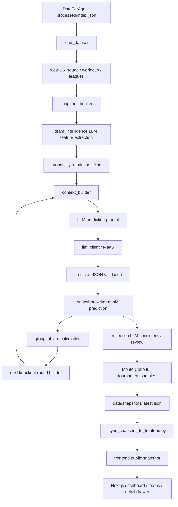

# Agent 架构与工具链

本文用于展示当前项目的系统架构设计、Agent 运行过程、开发过程中使用的工具链，以及下一步可完善方向。

## 目标对齐

原始目标要求：

- Agent 能采集或读取世界杯相关数据。
- Agent 能自主设计预测逻辑，完成小组赛、淘汰赛、决赛和冠军推演。
- Agent 能输出完整结果和可解释推理。
- 页面能可视化赛程树、对阵图、比分和冠军预测。

当前实现方式：

- 数据来源以 `DataForAgent` 为核心，尤其是 `wc_2026_squad_normalized.json`。
- 核心预测由 `worldcup_agent/llm_agent` 完成：球队画像 LLM 提炼特征，概率模型给出可复算基线，预测 LLM 输出单场结果，反思 LLM 复核结果逻辑，Monte Carlo 引擎抽样完整赛事得到概率分布。
- `snapshot_writer` 按赛事顺序推进，逐场预测并逐轮生成后续对阵。
- 前端读取同步后的 `latest.json`，展示首页、赛程树、分组、数据来源和 Agent trace。

## 系统架构



## Agent 分层

### 1. 数据层

位置：

```text
worldcup_agent/data_layer/dataforagent_loader.py
DataForAgent/data/processed/
```

职责：

- 读取 `DataForAgent/data/processed/index.json`。
- 根据 dataset key 加载 `leagues`、`worldcup`、`wc2026_squad`。
- 为上层 Agent 提供统一的结构化输入。

使用工具：

- Python `json`
- 本地文件系统
- DataForAgent 处理产物

### 2. 赛事结构层

位置：

```text
worldcup_agent/llm_agent/snapshot_builder.py
```

职责：

- 从赛前球队名单生成 12 个小组。
- 每组生成 6 场小组赛，共 72 场。
- 根据积分榜生成 32 强淘汰赛初始对阵。
- 根据前一轮胜者生成 16 强、8 强、半决赛、决赛和三四名决赛。

使用工具：

- Python 标准库
- 自定义赛程生成逻辑
- `latest.json` 快照结构

### 3. LLM 上下文层

位置：

```text
worldcup_agent/llm_agent/context_builder.py
```

职责：

- 为每场比赛组装 LLM 输入。
- 输入包含比赛信息、赛前预测占位、球队资料、教练、关键球员、排名、ELO、数据覆盖情况。
- 控制 prompt payload 大小，避免把整份数据无差别塞给模型。

使用工具：

- DataForAgent 数据集
- `worldcup_agent/data_layer/cleaned/teams_2026_enriched.json`
- `frontend/src/knowledge/coaches_knowledge.json`
- `frontend/src/knowledge/players_knowledge.json`

### 4. LLM 预测层

位置：

```text
worldcup_agent/llm_agent/llm_client.py
worldcup_agent/llm_agent/predictor.py
```

职责：

- 读取 `.env.local` 中的 LLM 配置。
- 调用兼容 OpenAI Chat Completions 协议的服务。
- 要求 LLM 只输出 JSON。
- 清洗概率、比分、胜负、置信度和推理因子。
- 当没有 API 或设置 `LLM_DISABLE=1` 时，使用本地 fallback 生成可运行结果。

固定输出字段：

```json
{
  "winner": "home|away|draw",
  "predicted_score": "2-1",
  "home_win_prob": 0.58,
  "draw_prob": 0.22,
  "away_win_prob": 0.20,
  "confidence": "High|Medium|Low",
  "reasoning": "中文原因",
  "reasoning_factors": [
    {
      "type": "tactical|form|home|fitness|injury|transition",
      "label": "中文短标题",
      "description": "中文原因",
      "weight": 0.25
    }
  ]
}
```

使用工具：

- 讯飞 MaaS / OpenAI-compatible API
- Python `urllib.request`
- 环境变量 `.env.local`
- 重试、超时、请求间隔控制

### 5. Monte Carlo 模拟层

位置：

```text
worldcup_agent/llm_agent/monte_carlo.py
```

职责：

- 使用固定随机种子，重复模拟完整小组赛和 32 强到决赛的淘汰赛路径。
- 小组赛采用球队画像概率基线与 LLM 单场概率的加权分布，采样胜平负和比分后重算积分榜。
- 淘汰赛基于当次模拟的真实出线队伍动态配对，统计小组出线、各轮晋级、冠亚季军和冠军概率。
- 将 `simulation` 明细、冠军计数和 `monte_carlo_tool` trace 写入 canonical snapshot。

运行参数：

- `MONTE_CARLO_RUNS`：默认 `10000`。
- `MONTE_CARLO_SEED`：默认 `20260710`，同一输入和种子可复现相同结果。
- `--simulation-runs N`：本次命令临时覆盖样本数。
- `--skip-simulation`：仅用于快速调试，不执行模拟。

### 6. 快照写入与赛事推进层

位置：

```text
worldcup_agent/llm_agent/snapshot_writer.py
```

职责：

- 调用 `snapshot_builder` 重建赛事。
- 批量预测小组赛。
- 根据比分重算积分榜。
- 生成 32 强淘汰赛。
- 逐轮调用 LLM 预测并生成下一轮。
- 写入 `data/snapshots/latest.json`。
- 记录 `reasoning_chain`，说明本次预测由哪个模型和 provider 完成。

使用工具：

- Python 文件写入
- 本地 JSON 快照
- LLM predictor
- 赛事推进函数

### 7. multi-agent 辅助层

位置：

```text
worldcup_agent/multi_agent/
```

职责：

- 展示多 Agent 协作式的运行 trace。
- 对 canonical snapshot 做数据加载、强度摘要、反思检查、解释生成和质量检查。
- 输出到 `data/multi_agent/multi_agent_output_*.json`。

当前定位：

- 辅助层，不是核心赛果生成层。
- 核心赛果以 `llm_agent` 写入的 `latest.json` 为准。

使用工具：

- 自定义 `BaseAgent`
- 共享 `WorldState`
- ReAct 风格 observe/think/act/evaluate 执行记录

### 8. 前端可视化层

位置：

```text
frontend/src/app/
frontend/src/components/
frontend/src/lib/
```

职责：

- 读取 `frontend/public/data/snapshots/latest.json`。
- 将 snapshot 转换为前端 bracket 数据结构。
- 展示首页冠军预测、Top 5、小组积分、赛程树。
- 点击比赛节点后展示 LLM 原因、原因因子、概率和数据来源。

使用工具：

- Next.js App Router
- TypeScript
- Tailwind CSS
- lucide-react
- Recharts
- 自定义 i18n

## 开发过程中的工具链

### 代码理解与定位

- `rg` / `rg --files`: 快速定位入口、类型、组件、旧文档和字段使用位置。
- PowerShell: 在 Windows 环境下运行 Python、Node、JSON 校验和文件检查。
- `git status --short` / `git diff`: 控制改动范围，避免覆盖无关文件。

### 数据与快照校验

- `python -m json.tool data\snapshots\latest.json`: 验证 JSON 合法性。
- `python -m compileall worldcup_agent\llm_agent scripts\generate_and_sync.py`: 验证 Python 语法。
- `scripts/sync_snapshot_to_frontend.py`: 保证前后端读取同一份快照语义。

### LLM 调试

- `--llm-match-limit`: 小批量调用，验证模型连通性和 JSON 输出。
- `--require-llm`: 强制真实 LLM，不允许静默 fallback。
- `LLM_DISABLE=1`: 快速走本地 fallback，验证数据结构和前端。
- `LLM_MAX_RETRIES` / `LLM_REQUEST_DELAY_SECONDS`: 应对 provider 429/500/超时等不稳定情况。

### 前端调试

- Next.js dev overlay: 定位 hydration mismatch、React key 重复等问题。
- `npm run lint`: ESLint 检查。
- `npm run build`: Next.js 生产构建和 TypeScript 检查。
- 浏览器点击交互: 验证比赛节点弹窗是否展示 LLM 原因。

## 运行链路

完整生成：

```powershell
python scripts\generate_and_sync.py --require-llm
```

只跑 LLM 层并同步：

```powershell
python scripts\generate_and_sync.py --require-llm --skip-agent
```

小批量 LLM 测试：

```powershell
python scripts\generate_and_sync.py --require-llm --llm-match-limit 10 --skip-agent
```

前端启动：

```powershell
cd frontend
npm run dev -- -p 3000
```

## 当前完成度

已完成：

- 数据源接入：DataForAgent 数据集可被后端读取。
- 赛事结构：支持 48 队、12 组、72 场小组赛、32 强淘汰赛。
- LLM 推理：支持逐场输入上下文并输出固定 JSON。
- 推进机制：小组赛结果影响积分榜，积分榜影响淘汰赛。
- 可解释性：每场比赛有 reasoning 和 reasoning factors。
- 前端可视化：首页、赛程树、分组、比赛弹窗、数据页、Agent 页。
- 稳定性处理：LLM 重试、请求间隔、fallback、中文球队 id。

## 待完善项

### 高优先级

- 为 LLM 输出引入 JSON Schema 校验，失败时自动发起修复 prompt。
- 增加断点续跑和 match-level cache，避免长时间完整预测失败后重跑。
- 为 `snapshot_builder` 和 `snapshot_writer` 增加单元测试。
- 为前端 `snapshot-to-bracket` 增加中文队名 id、round_of_32、group match 转换测试。

### 中优先级

- 扩展数据源：伤病、近期国家队比赛、球员出场时间、赛程城市和旅行距离。
- 将旧 `worldcup_agent/prediction` 和过期文档标注 legacy 或归档。
- 为 `.env.local` 增加更细的配置说明，例如不同 provider 的 endpoint 示例和故障排查表。

### 低优先级

- 强化 `/teams` 页面，展示教练、关键球员、分组和预测路径。
- 增加快照对比视图，展示两次 LLM 运行间预测变化。
- 增加导出演示报告或 PPT 的脚本。
